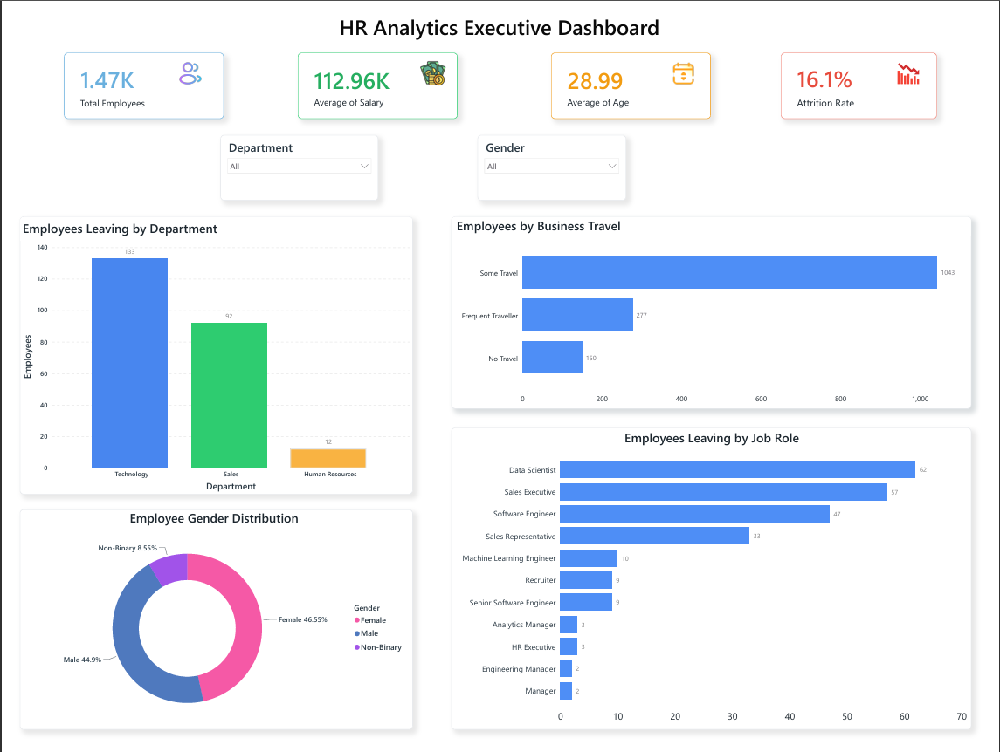
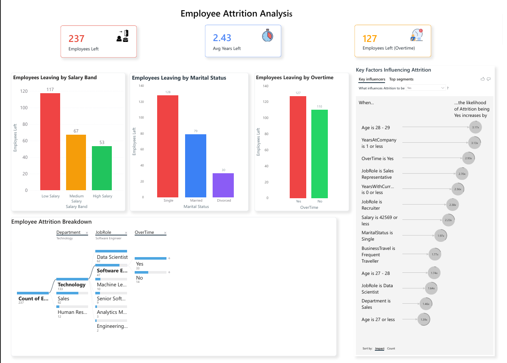

# 📊 HR Analytics Dashboard

An interactive **HR Analytics Dashboard** built using **SQL, Power BI, DAX, and Power Query** to analyze employee attrition, workforce demographics, compensation trends, and organizational insights. The project demonstrates how business intelligence tools can transform HR data into actionable insights for better decision-making.

---

# 🎯 Project Objective

The objective of this project is to analyze employee data to identify the key factors associated with employee attrition, understand workforce demographics, and build interactive dashboards that support data-driven HR decision-making.

---

# 📂 Dataset

This project uses a simulated HR Analytics dataset containing employee information such as:

- Employee Demographics
- Department & Job Role
- Salary
- Business Travel
- Overtime
- Marital Status
- Education Level
- Performance Ratings
- Employee Satisfaction
- Years at Company

The data was explored using SQL, transformed using Power Query, modeled in Power BI, and enhanced with DAX measures to create interactive dashboards.

---

# 🛠️ Technologies Used

| Technology | Purpose |
|------------|---------|
| SQL | Data querying and analysis |
| Power BI | Dashboard development and visualization |
| DAX | KPI calculations and business measures |
| Power Query | Data cleaning and transformation |
| Microsoft Excel | Supporting data analysis |
| Git & GitHub | Project documentation and version control |

---

# 📷 Dashboard Preview

## Executive Dashboard

### Key Visualizations

- Total Employees
- Attrition Rate
- Average Salary
- Average Employee Age
- Department-wise Attrition
- Business Travel Analysis
- Job Role Distribution
- Gender Distribution
- Interactive Department & Gender Slicers

---

## Employee Attrition Analysis

### Key Visualizations

- Employees Left
- Average Years Before Leaving
- Attrition by Salary Band
- Attrition by Marital Status
- Attrition by Overtime
- Key Influencers Visual
- Decomposition Tree Analysis

---

# 💼 Business Questions Answered

- Which departments experience the highest employee attrition?
- Does overtime influence employee attrition?
- Which salary band experiences the highest employee turnover?
- Which marital status has the highest employee attrition?
- Which job roles contribute the highest employee exits?
- What factors are most strongly associated with employee attrition?

---

# 📈 Key Insights

- Employees working overtime account for a higher number of employee exits than those who do not work overtime.
- Employees in the **Low Salary Band** experience the highest attrition.
- **Single employees** show higher attrition than married or divorced employees.
- Employees leaving the organization have an average tenure of **2.43 years**, suggesting higher turnover among relatively newer employees.
- Employees with fewer years at the company are more likely to leave.
- Sales Representatives and Recruiters are among the job roles with comparatively higher employee attrition.
- Employees who travel frequently for business demonstrate higher attrition.
- Key Influencers analysis highlights **age, overtime, salary level, years at the company, and job role** as important factors related to employee attrition.

---

# 🚀 Project Highlights

- Interactive Executive Dashboard
- Employee Attrition Analysis Dashboard
- SQL Data Analysis
- Advanced DAX Measures
- Power Query Data Transformation
- KPI Reporting
- Interactive Slicers & Cross-filtering
- Key Influencers Analysis
- Decomposition Tree Analysis
- Business Intelligence Reporting

---

# 👩‍💻 Author

**Sneha**

**Skills:** SQL • Power BI • DAX • Power Query • Microsoft Excel • Data Visualization • Data Modeling • Business Intelligence • Git & GitHub

---

⭐ If you found this project helpful, consider giving the repository a star.